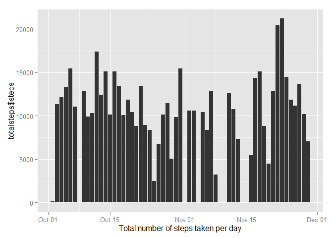
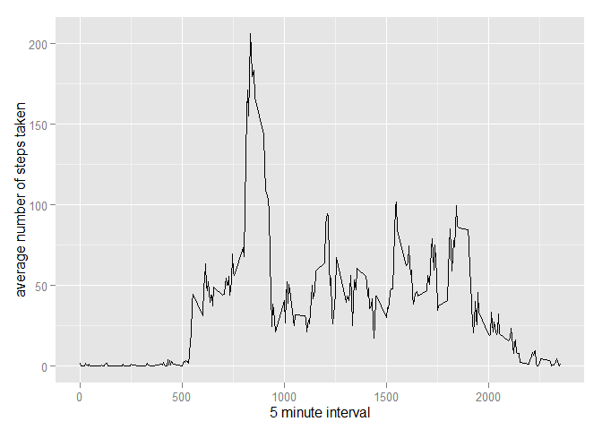
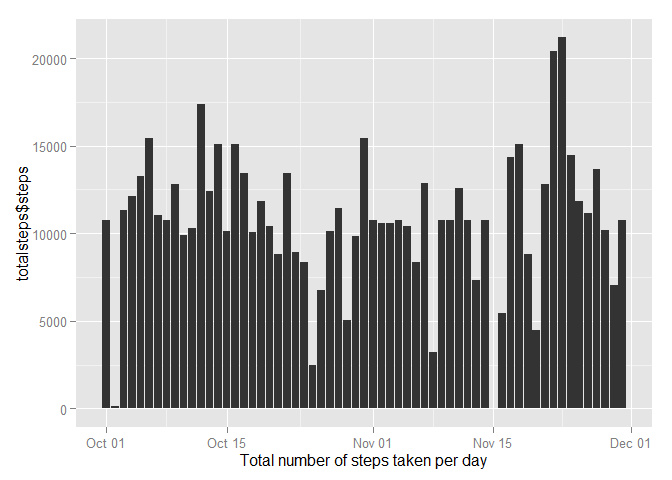
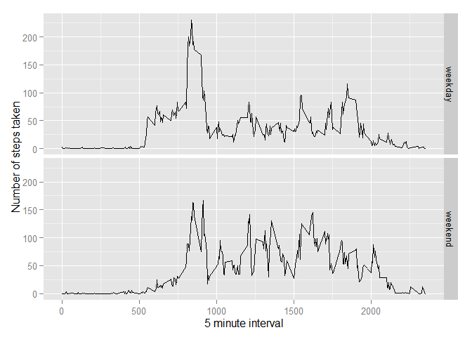

# Reproducible Research: Peer Assessment 1


```r
knitr::opts_chunk$set(warning=FALSE, message=FALSE)
```


## Loading and preprocessing the data


```r
unzip(zipfile="activity.zip")
data <- read.csv("activity.csv")
data$date <- as.Date(data$date)
```

## What is mean total number of steps taken per day?


```r
library(ggplot2)
totalsteps <- aggregate(steps ~ date,data = data,sum,na.rm=TRUE)
qplot(totalsteps$date,totalsteps$steps,stat="identity",geom="histogram", xlab = "Total number of steps taken per day")
```

 

```r
mean(totalsteps$steps, na.rm=TRUE)
```

```
## [1] 10766.19
```

```r
median(totalsteps$steps,na.rm=TRUE)
```

```
## [1] 10765
```

## What is the average daily activity pattern?


```r
library(ggplot2)
avg <- aggregate(steps ~ interval, data, mean, na.rm=TRUE)
ggplot(avg, aes(interval,steps)) +
  geom_line() +
  xlab("5 minute interval") +
  ylab("average number of steps taken")
```

 
The 5-minute interval contains the maximum number of steps taken

avg[which.max(avg$steps),]


## Imputing missing values

The number of missing values


```r
sum(is.na(data))
```

```
## [1] 2304
```
All of the missing values are filled in with the mean value for that 5-minute interval.


```r
fill <- function(steps,interval) {
  fill <- NA
  if (!is.na(steps))
    fill <- c(steps) else fill <- avg[avg$interval == interval,"steps"]
    return(fill)
}
filldata <- data
filldata$steps <- mapply (fill, filldata$steps,filldata$interval)
```

Histogram of the total number of steps taken each day and calculate the mean and median total number of steps.


```r
totalsteps <- aggregate(steps ~ date,data = filldata,sum)
qplot(totalsteps$date,totalsteps$steps,stat="identity",geom="histogram", xlab = "Total number of steps taken per day")
```

 

```r
mean(totalsteps$steps)
```

```
## [1] 10766.19
```

```r
median(totalsteps$steps)
```

```
## [1] 10766.19
```

## Are there differences in activity patterns between weekdays and weekends?

```r
what.day <- function(date) {
  day <- weekdays(date)
  if (day %in% c("Monday","Tuesday","Wednesday","Thursday","Friday"))
    return("weekday") else if (day %in% c("Saturday","Sunday"))
    return ("weekend") else stop("invalid")
}
filldata$date <- as.Date(filldata$date)
filldata$day <- sapply(filldata$date, what.day)
```

Panel plots


```r
library(ggplot2)
avg <- aggregate(steps ~ interval + day,filldata,mean)
ggplot(avg, aes(interval,steps)) + geom_line() +
  facet_grid(day ~.) + xlab("5 minute interval") +
  ylab("Number of steps taken")
```

 
